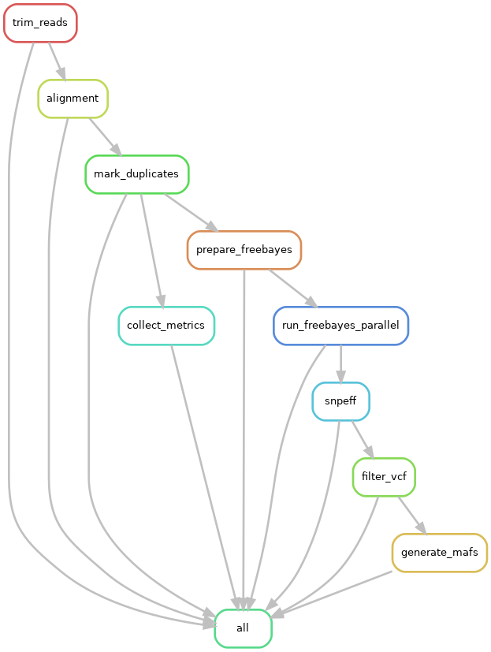

# WES-pipeline


**Pipeline for targetted whole exome sequencing / variant analysis**

## Table of Contents
- [Introduction](#introduction)
- [Pipeline](#pipeline)
- [Prerequisities](#prerequisites)
- [Files](#files)
- [Implementation](#implementation)
- [Optional](#optional)

## Introduction
This pipeline is meant to process whole-exome sequencing (WES) data. Currently, this pipeline is compatible *only* on the [Dartmouth Discovery HPC](https://rc.dartmouth.edu/discoveryhpc/). This repository houses the necessary files to implement this pipeline via a snakemake workflow and SLURM-job submission script to run processes in parallel. 

Please note that this pipeline [requires prerequisites](#prerequisites) to run properly. 
Example data are from a targetted mouse WES experiment. Two samples are included and have been downsampled to 0.5% of the original data (for storage purposes on this repo.)

## Pipeline


|Rule|Purpose|Outputs|Software|
|----|-------|-------|--------|
|trim_reads|Trim raw fastqs to remove low quality bases and adapter sequences|`trimming/` directory containing trimmed fastq.gz files|[cutadapt 4.6](https://cutadapt.readthedocs.io/en/stable/)|
|alignment| Align trimmed reads to reference genome with BWA-MEM|`alignment/` directory containing aligned bam files and their corresponding index (.bai) files|[BWA 0.7.17](https://bio-bwa.sourceforge.net/bwa.shtml)|
|mark_duplicates|Flag duplicate reads|`markdup/` directory containing bam files with duplicates flagged|[Picard 2.27.1](https://broadinstitute.github.io/picard/) [Bedtools 2.29.1](https://bedtools.readthedocs.io/en/latest/)|
|prepare_freebayes|Prepare a text file of freebayes commands to be ran in parallel|`all_freebayes_commands.txt` text file|[freebayes 1.3.8](https://github.com/freebayes/freebayes)|
|collect_metrics|Collect hybrid-selection metrics|`metrics/` directory containing metrics files|[Picard 2.27.1](https://broadinstitute.github.io/picard/)|
|run_Freebayes_parallel|Run the freebayes commands|`freebayes/` directory containing raw vcf files|[freebayes 1.3.8](https://github.com/freebayes/freebayes) [GNU parallel](https://savannah.gnu.org/forum/forum.php?forum_id=10039)|
|snpeff|Annotate raw vcf files|`snpeff/` directory containing annotated vcf files|[snpeff ](https://pcingola.github.io/SnpEff/) [bcftools 1.21](https://samtools.github.io/bcftools/bcftools.html)|
|filter_vcf|Filter out variants called on mitochondrial, X, and Y chromosomes, as well as variants called on unplaced scaffolds|`filtered/` directory containing filtered vcf files|[bcftools 1.21](https://samtools.github.io/bcftools/bcftools.html)|
|generate_mafs|Convert filtered vcf files to maf format for downstream analysis, place all region text files in their own directory|`MAFs/` directory containing filtered MAF files. `regions/` folder containing all x* region text files.|[vcf2maf](https://github.com/mskcc/vcf2maf)|


## Prerequisites
In order to successfully run this pipeline, you will need a target regions file which indicates which genomic coordinates were targetted during the library preparation stage. Example data included in this repository are derived from samples targetted with the [Twist Mouse Exome Panel](https://www.twistbioscience.com/products/ngs/fixed-panels/mouse-exome-panel). The regions file, which should be in [bed format](https://genome.ucsc.edu/FAQ/FAQformat.html#format1) will be used to direct mapping and parallelize freebayes commands. Included in this repository is the `Twist_Mouse_Exome_Target_Rev1_7APR20.bed` file, which is built on the [GRCm38 mm10 genome](https://genome.ucsc.edu/cgi-bin/hgGateway?db=mm10). 

To generate these regions, along with a sequence dictionary and interval list, you *must* run the `001_prepare_bed_list.sh` script. This script is a simple SLURM-job submission script, built for compatibility on the [Dartmouth Discovery HPC](https://rc.dartmouth.edu/discoveryhpc/). In this script, you must edit the `TARGETS`, `REF`, and `ORG` arguments. `TARGETS` expects the full path to your exome target bed file and `REF` expects the full path to your organisms reference in [fasta format](https://www.ncbi.nlm.nih.gov/genbank/fastaformat/#:~:text=In%20FASTA%20format%20the%20line,should%20not%20contain%20any%20spaces.) `ORG` expects the organism genome build to dynamically name output files.

To run the code, run the following command:

```shell
# In the 001_prepare_bed_list.sh file
#----- Set paths
TARGETS="Twist_Mouse_Exome_Target_Rev1_7APR20.bed" # EDIT TO YOUR PATH/FILE BEFORE RUNNING
REF="mm10.fa" # EDIT TO YOUR REFERENCE FASTA BEFORE RUNNING
ORG="mm10" # EDIT TO YOUR ORGANISM GENOME BUILD BEFORE RUNNING

```

```shell
# Run the prerequisite code
sbatch 001_prepare_bed_list.sh
```

## Files
In summary, the following prerequisites are required to run:

|File/Directory|Type/Format|Description|
|----|---------|------------------------------------------------|
|`data/`|directory|Directory containing raw sequencing files in fastq.gz format|
|`sample_fastq_list_paired.txt`|file, tab separated| three column table where column 1 is `sample_id`, column 2 is the full path to the forward read for that sample and column 3 is the full path to the reverse read|
|`targets.bed`| file, bed format|bed file specifying genomic regions targetted during library prep|
|`reference.fa`|file, fasta format|fasta file for your organism. Required for script `001_prepare_bed_list.bash`|
|`bed.list`| file, txt format| text file generated in `001_prepare_bed_list.bash`|

Examples of these files can be found in the `example_files/` folder.
Example data (downsampled fastq.gz files) can be found in the `example_data/` folder.


## Implementation

Clone this repository:
```shell
git clone https://github.com/Dartmouth-Data-Analytics-Core/DAC-WES-pipeline
cd DAC-WES-pipeline
```

Activate an environment containing Snakemake:
```shell
conda activate /dartfs/rc/nosnapshots/G/GMBSR_refs/envs/snakemake
```

To implement this pipeline, ensure your sequencing files exist in a directory called 'data'. You will need to generate a file called `sample_fastq_list_paired.txt`. This is a three column, tab-separated file. For description of fields see [Files](#files). 

Once complete, the following outputs should be present in your working directory:

**1.** `bed.list` (a list of text files generated)

**2.** `<genome>.dict` (a genome specific sequence dictionary)

**3.** `<genome>.interval_list` (a genome specific interval list)

**4.** A number of text files starting with `xaa`, `xab`, `xac`, etc.. (these files contain the genomic region chunks pulled from the `targets.bed` file

Paths to your sample file and genome references *must* be specified in the `config.yaml` file. Additionally, user email for SLURM-job status updates can be specified in the SBATCH header in `/cluster_profile/config.yaml`.

Once these files are generated, submit the snakemake job script.
```shell
sbatch job.script.sh
```

A "driver" log file will be generated with the file name `WES_Pipeline_<jobID>.out` which contains log and error information for the snakemake pipeline. Jobs farmed-out to nodes on the HPC will generate their own log files with the file names `log_<rule_name>_<jobID>.out` to facilitate easier debugging. If an error is observed in the driver log, use the job number and rule listed to find that specific log file for more in-depth error information. 

Upon completetion of this pipeline, the following directories will be present:

|Directory|Description|
|---------|-----------|
|`trimming/`|Contains trimmed fastq files|
|`alignment/`|Contains bam and bai files|
|`freebayes/`|Contains raw vcf files|
|`snpeff/`|Contains annotation vcf files|
|`filtered/`|Contains filtered and annotated vcf files|
|`MAFs/`|Contains filtered and annotated MAF files|

For downstream analyses, vcf files in the `filtered` directory or MAF files in the `MAFs` directory can be used in R.

## Optional
As an extra analysis, one can determine the mutational signatures using the [COSMIC Database](https://cancer.sanger.ac.uk/signatures/) using the following code `SigProfilerAssignment.sh` which is derived from the [SigProfilerAssignment tool](https://osf.io/mz79v/wiki/home/), but adapted for use on the [Dartmouth Discovery HPC](https://rc.dartmouth.edu/discoveryhpc/).

To implement this, run the following commands to prepare to run the script:

```shell
# Within your working directory, clone the tool from github
git clone https://github.com/vanallenlab/SigProfilerAssignment.git
```

```shell
# Enter the tool's directory
cd SigProfilerAssignment
```

```shell
# Activate conda environment with dependencies
conda activate SigProfilerAssignment
```

```shell
# Install dependencies in conda environment
conda install python=3.11 pandas
```

```shell
# Install the tools with pip, MUST have conda activated
pip install -r requirements.txt -t .
```

```shell
# Run the job script
sbatch run_sigProfilerAssignment.sh
```
